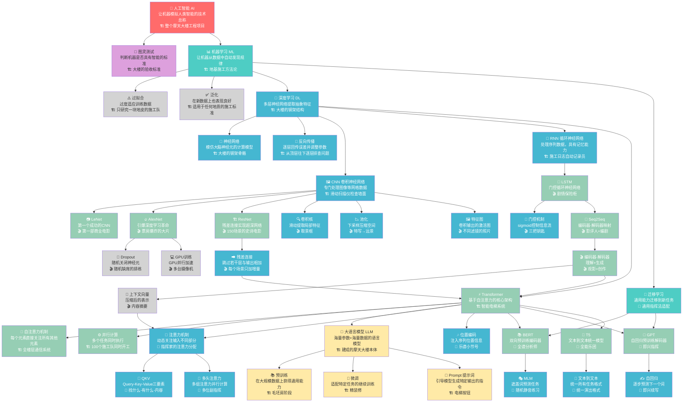

# AI 知识图谱

> 🗺 本文档使用 Mermaid 格式绘制，可在支持 Mermaid 的 Markdown 编辑器中直接预览。
> 每天学习新内容后，会追加新节点和连线。
> **本文档可自由编辑和更新。**

---

## 图谱说明

- 🔴 红色：顶层概念（AI）
- 🟢 绿色：方法论层（ML）
- 🔵 蓝色：技术层（DL 及其分支）
- 🟡 黄色：应用层（LLM 等）
- ⚪ 灰色：辅助概念（过拟合、泛化等）

---

## 完整知识图谱

---

## 更新日志

| 日期 | Day | 新增节点 | 新增连线 |
|------|-----|---------|---------|
| 2025-04-15 | Day 1 | AI, ML, DL, NN, BP, CNN, RNN, Transformer, Attention, Parallel, LLM, Pretrain, Finetune, Prompt, TuringTest, Overfit, General | AI→ML→DL→{CNN,RNN,Transformer}, Transformer→{Attention,Parallel,LLM}, LLM→{Pretrain,Finetune,Prompt}, ML→{Overfit,General}, AI→TuringTest, DL→{NN,BP} |
| 2026-04-17 | Day 3 | LeNet, AlexNet, ResNet, ResConn, ConvK, Pool, FeatMap, Drop, GPUTr, LSTM, Gate, Seq2Seq, EncDec, CtxVec | CNN→{LeNet,AlexNet,ResNet,ConvK,Pool,FeatMap}, ResNet→ResConn, AlexNet→{Drop,GPUTr}, RNN→LSTM, LSTM→{Gate,Seq2Seq}, Seq2Seq→EncDec→{CtxVec,Transformer}, ResConn→Transformer |
| 2026-04-18 | Day 4 | Attn, QKV, MHA, PosEnc, BERT, GPT, T5, MLM, AR, TL, T2T | Transformer→{Attn,PosEnc,BERT,GPT,T5}, Attn→{QKV,MHA}, BERT→MLM, GPT→AR, T5→T2T, ML→TL→{BERT,GPT}, CtxVec→Attn |
