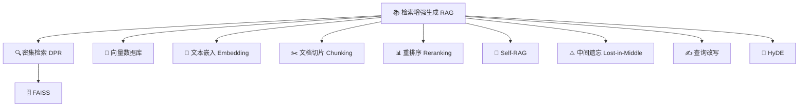

# Day 17 — 检索增强生成（RAG）：知识库 + 大模型的融合之道

> 📅 日期：2026-05-19（周二）
> 📍 阶段二·领域深潜（Day 11-20）| 第 17 天
> 🎯 今日主题：检索增强生成（RAG）——让大模型接入外部知识、减少幻觉、实时更新

---

## 🎯 今日定位

在学完强化学习之后，我们今天转向一个**极具工程落地价值**的方向——检索增强生成（Retrieval-Augmented Generation, RAG）。大模型的参数知识是"冻结"在训练时刻的，RAG 让模型在生成时动态检索外部知识库，解决了幻觉、时效性、领域适配三大痛点。这是当前企业 AI 落地最主流的技术路线之一。

---

## 🧩 统一比喻主题：📚 经营一家超级图书馆的智慧问答台

> 把 RAG 系统想象成一家超级图书馆的问答服务台：
> - **大模型** = 问答台的学者（学识渊博但记忆有限、知识可能过时）
> - **向量数据库** = 图书馆的智能书架系统（能瞬间找到相关书籍）
> - **检索器** = 图书管理员（根据问题找到最相关的参考资料）
> - **文档切片** = 把大部头拆成便于查阅的章节卡片
> - **Embedding** = 每本书的"内容指纹"（语义摘要向量）
> - **重排序器** = 高级参考咨询员（精细排列检索结果的相关性）
> - **上下文窗口** = 问答台学者桌面大小（能同时参考多少资料）

---

## 📄 今日论文推荐（5 篇）

---

### 论文 1：Retrieval-Augmented Generation for Knowledge-Intensive NLP Tasks

| 项目 | 内容 |
|------|------|
| **标题** | Retrieval-Augmented Generation for Knowledge-Intensive NLP Tasks |
| **作者** | Patrick Lewis, Ethan Perez, Aleksandra Piktus, Fabio Petroni, Vladimir Karpukhin, Naman Goyal, Heinrich Küttler, Mike Lewis, Wen-tau Yih, Tim Rocktäschel, Sebastian Riedel, Douwe Kiela |
| **来源** | NeurIPS 2020 |
| **年份** | 2020 |
| **权威性** | ⭐⭐⭐⭐⭐ |
| **链接** | [arXiv](https://arxiv.org/abs/2005.11401) |

**📝 内容简介**：RAG 概念的正式提出——将参数化记忆（预训练模型）和非参数化记忆（检索知识库）融合为统一生成框架，首次系统化定义了"检索增强生成"范式。

**📜 摘要翻译**：
大型预训练语言模型已被证明能将事实知识存储在其参数中，并在下游 NLP 任务上微调后取得最先进结果。然而，它们访问和精确操作知识的能力仍然有限，因此在知识密集型任务上的表现落后于特定的任务架构。此外，为其决策提供出处和更新其世界知识仍然是开放性研究问题。具有可微访问机制的预训练模型是唯一已探索的非参数化记忆与预训练模型结合的方法，但此前的工作仅关注了提取式下游任务。我们探索了一种通用的微调方法——检索增强生成（RAG），该方法结合了预训练的参数化和非参数化记忆用于语言生成。我们构建了 RAG 模型，其中参数化记忆是预训练的 seq2seq 模型，非参数化记忆是维基百科的密集向量索引，通过预训练的神经检索器访问。我们比较了两种 RAG 表述：一种在整个生成序列中使用相同的检索段落，另一种可以针对每个 token 使用不同的段落。我们在广泛的知识密集型 NLP 任务上微调和评估了模型，包括三个开放域问答任务，在所有任务上都达到了最先进水平，超越了参数化 seq2seq 模型和特定任务的检索-提取架构。对于语言生成任务，我们发现 RAG 模型生成的语言比纯参数化 seq2seq 基线更具体、更多样、更符合事实。

**💡 核心观点深度解读**：

检索增强生成（RAG）的核心洞察是：大语言模型不需要"记住"所有知识——它只需要知道如何"查阅"和"整合"知识。这是一种将AI系统从"百科全书式记忆"转向"图书管理员+学者"协作模式的范式转变。

用图书馆比喻来理解：传统的大模型就像一位学者试图把所有书的内容都背下来——这不仅不现实（参数有限），而且背下来的知识会过时（训练数据截止），还可能记错（幻觉）。RAG的思路是：给这位学者配备一个智能图书管理员和完善的藏书系统。学者收到问题后，先让管理员找到最相关的参考书页，然后基于这些参考资料给出有据可依的回答。

技术上，RAG 模型由两个核心组件构成：一个基于 DPR（Dense Passage Retrieval）的神经检索器负责从维基百科等知识库中找到相关段落，一个基于 BART 的 seq2seq 生成器负责将问题和检索到的段落融合生成最终答案。论文提出了两种变体：RAG-Sequence（对整个输出序列使用相同的检索结果）和 RAG-Token（每生成一个token都可以参考不同的检索结果）。

这篇论文对后续整个行业产生了深远影响。2024-2026年几乎所有企业级AI应用都采用了RAG架构——从客服系统到法律助手，从医疗问答到代码补全。RAG成为了连接大模型能力与企业私有知识的标准桥梁。

**🏆 关键贡献**：
- 首次正式提出 RAG 框架，将参数化记忆与非参数化记忆统一为端到端可训练的生成模型，定义了"检索+生成"的标准范式
- 提出 RAG-Sequence 和 RAG-Token 两种检索粒度变体，探索了检索结果与生成过程的不同融合方式
- 在开放域问答等知识密集型任务上超越所有纯参数化模型，证明外部检索能有效补充模型参数知识
- 证明 RAG 生成的文本更具事实性、多样性和具体性，为解决大模型幻觉问题提供了系统方案

**🌟 为什么重要**：
RAG 是连接大模型与外部知识的奠基之作，NeurIPS 2020 发表后被引超4000次。它直接催生了 LangChain、LlamaIndex 等工具生态，是当前企业 AI 落地最广泛采用的技术架构。没有 RAG，大模型就是一个"知识孤岛"——有能力但缺乏实时更新的知识接口。

**核心概念卡片**：
| 概念 | 定义 | 比喻 |
|------|------|------|
| 检索增强生成（RAG） | 在生成时动态检索外部知识并融合到输出中 | 学者回答问题前先让管理员找来参考书 |
| 参数化记忆 | 存储在模型权重中的知识 | 学者脑中记忆的知识 |
| 非参数化记忆 | 存储在外部可检索数据库中的知识 | 图书馆书架上的藏书 |
| 密集检索 | 用向量相似度而非关键词匹配来检索文档 | 按内容语义而非书名字母来找书 |

---

### 论文 2：Dense Passage Retrieval for Open-Domain Question Answering (DPR)

| 项目 | 内容 |
|------|------|
| **标题** | Dense Passage Retrieval for Open-Domain Question Answering |
| **作者** | Vladimir Karpukhin, Barlas Oguz, Sewon Min, Patrick Lewis, Ledell Wu, Sergey Edunov, Danqi Chen, Wen-tau Yih |
| **来源** | EMNLP 2020 |
| **年份** | 2020 |
| **权威性** | ⭐⭐⭐⭐⭐ |
| **链接** | [arXiv](https://arxiv.org/abs/2004.04906) |

**📝 内容简介**：RAG 系统的"图书管理员"核心技术——用双塔 BERT 编码器将问题和段落映射到同一向量空间，通过向量相似度实现高效语义检索，取代传统 BM25 关键词匹配。

**📜 摘要翻译**：
开放域问答依赖于高效的段落检索来选择候选上下文，传统上使用 TF-IDF 或 BM25 等稀疏向量空间模型来实现。在本工作中，我们证明检索可以仅使用密集表示来实现，其中嵌入通过简单的双编码器框架从少量问题和段落对中学习得到。当在广泛的开放域 QA 数据集上评估时，我们的密集检索器在 top-20 段落检索准确率上大幅超越了强大的 Lucene BM25 系统，取得了9%到19%的绝对提升，并帮助我们的端到端 QA 系统在多个开放域 QA 基准上建立了新的最先进水平，这些基准可与现有的大型预训练模型相媲美甚至超越。

**💡 核心观点深度解读**：

DPR 解决的是 RAG 系统中最关键的第一步——如何在海量文档中快速准确地找到与用户问题最相关的段落。传统的 BM25 检索依赖关键词精确匹配，面对语义相似但用词不同的查询束手无策。DPR 用深度学习彻底改变了这个游戏规则。

用图书馆比喻理解：传统检索就像图书管理员只看书名和目录中的关键词来找书——你问"全球变暖的解决方案"，管理员只会找标题含"全球变暖"的书。DPR 训练管理员理解语义——"气候变化的应对策略"、"减碳技术"这些语义相关但用词不同的书也能被找到。

技术实现上，DPR 采用双塔架构：一个 BERT 编码器将问题映射为向量，另一个 BERT 编码器将段落映射为向量。训练时，用对比学习让匹配的问题-段落对向量靠近，不匹配的远离。推理时，所有段落向量预先计算好存入向量数据库（如 FAISS），查询时只需计算问题向量与所有段落向量的内积即可快速召回。

DPR 的成功开创了"密集检索"时代，直接催生了向量数据库（Pinecone、Weaviate、Milvus）的蓬勃发展，成为现代 RAG 系统的标准检索层。从 BM25 到 DPR 的转变，就像从纸质卡片目录升级到智能搜索系统——信息获取的维度从文字表面延伸到了语义深层。

**🏆 关键贡献**：
- 证明简单的双编码器密集检索器可以大幅超越精心调优的 BM25 稀疏检索，在 top-20 准确率上提升 9-19 个百分点
- 提出了高效的对比学习训练方法（in-batch negatives + hard negatives），大幅降低了密集检索器的训练成本
- 建立了段落级密集检索的标准范式，为后续所有 RAG 系统提供了检索层基础设施

**🌟 为什么重要**：
DPR 是现代语义检索的奠基之作，EMNLP 2020 发表被引超4500次。它让"以向量搜索代替关键词搜索"从学术理论变为工业实践，直接推动了向量数据库行业的爆发（2023-2025年 Pinecone/Weaviate/Milvus 融资超30亿美元）。当前几乎所有 RAG 系统的检索层都源自 DPR 的思想。

**核心概念卡片**：
| 概念 | 定义 | 比喻 |
|------|------|------|
| 密集段落检索（DPR） | 用深度学习向量表示来检索文档段落 | 图书管理员读懂内容含义来找书 |
| 双塔编码器 | 问题和文档分别用独立编码器编码为向量 | 两位专员——一位解读问题、一位理解藏书 |
| 向量相似度 | 通过计算向量内积/余弦来衡量语义相关性 | 比较两本书的"内容指纹"有多相似 |
| In-batch Negatives | 同一批次中其他样本的文档作为负例训练 | 同一批咨询中其他人问的问题对应的书就是反面教材 |

---

### 论文 3：Retrieval-Augmented Generation for Large Language Models: A Survey

| 项目 | 内容 |
|------|------|
| **标题** | Retrieval-Augmented Generation for Large Language Models: A Survey |
| **作者** | Yunfan Gao, Yun Xiong, Xinyu Gao, Kangxiang Jia, Jinliu Pan, Yuxi Bi, Yi Dai, Jiawei Sun, Meng Wang, Haofen Wang |
| **来源** | arXiv (被引超2000次) |
| **年份** | 2024 |
| **权威性** | ⭐⭐⭐⭐⭐ |
| **链接** | [arXiv](https://arxiv.org/abs/2312.10997) |

**📝 内容简介**：RAG 技术的最全面综述论文——系统梳理了 RAG 从 Naive RAG → Advanced RAG → Modular RAG 的三代演进，覆盖检索、增强、生成三个维度的最新技术。

**📜 摘要翻译**：
大型语言模型（LLM）展示了显著的能力，但也面临挑战，如幻觉、过时的知识，以及不透明和不可追溯的推理过程。检索增强生成（RAG）已成为一种有前途的解决方案，通过整合来自外部数据库的知识来应对这些挑战。这增强了模型的准确性和可信度，特别是对于知识密集型任务，并允许持续的知识更新和领域特定信息的整合。RAG 将 LLM 的内在知识与外部数据库的广阔动态存储库协同结合。本综述全面审视了 RAG 范式的发展，包括 Naive RAG、Advanced RAG 和 Modular RAG。它详细考察了 RAG 框架的三个基础：检索、生成和增强技术。论文还介绍了 RAG 评估方法和基准的最新进展。最后，论文讨论了当前的挑战并指出未来的研究方向和发展趋势。

**💡 核心观点深度解读**：

这篇综述为理解 RAG 技术的全貌提供了系统化框架。它将 RAG 的发展分为三个阶段，清晰展示了技术从简单到复杂的演进路径。

用图书馆比喻来理解三代 RAG 的进化：**Naive RAG**（初级图书馆）——读者提问→管理员找书→学者照着念。问题：找的书可能不对，学者死板照念。**Advanced RAG**（高级图书馆）——增加了预检索（问题优化）和后检索（结果过滤排序）步骤，相当于增设了"参考咨询台"帮助读者精准提问，以及"资料审核员"过滤无关内容。**Modular RAG**（智慧图书馆）——所有环节模块化可组合，像乐高积木一样灵活拼装：可以加搜索引擎、知识图谱、多步推理等模块。

综述中总结的关键技术演进包括：检索端的 query rewriting（查询改写）、HyDE（假设文档生成）；增强端的 reranking（重排序）、compression（压缩）；生成端的 citation（引用追溯）、self-RAG（自适应检索决策）。这些技术组合起来形成了一个完整的工程实践指南。

对于从业者而言，这篇综述是入门 RAG 工程的最佳路线图。它让人理解：RAG 不是一个单一技术，而是一个由多个可替换模块组成的系统工程，每个环节都有多种技术选择和优化空间。

**🏆 关键贡献**：
- 首次系统定义 Naive/Advanced/Modular 三代 RAG 演进框架，为业界提供了统一的技术分类标准
- 全面梳理检索、增强、生成三个维度的最新技术进展（query改写、HyDE、重排序、自适应检索等），形成完整技术地图
- 总结 RAG 评估的方法论和基准（RAGAS、RGB等），为工程实践提供了量化指标体系
- 指明 Modular RAG 的未来趋势——检索、推理、工具使用的模块化组合将成为主流

**🌟 为什么重要**：
这是 RAG 领域引用量最高的综述论文（发布半年即超2000引用），几乎所有 RAG 项目的技术选型都参考此文。它将分散的 RAG 技术整合为统一框架，是工程师从"会用RAG"到"用好RAG"的必读文献。对于理解当前AI应用的技术栈架构，没有比这篇更系统的入门材料。

**核心概念卡片**：
| 概念 | 定义 | 比喻 |
|------|------|------|
| Naive RAG | 最基本的"检索-读取"流水线：切片→嵌入→检索→拼接→生成 | 初级图书馆：找书→照念 |
| Advanced RAG | 在检索前后加入优化步骤（查询改写、重排序、压缩） | 高级图书馆：增设参考咨询台和资料审核员 |
| Modular RAG | 所有组件模块化可插拔可组合的灵活架构 | 智慧图书馆：乐高式自由拼装的知识服务系统 |
| 查询改写 | 优化用户原始问题使其更适合检索 | 参考咨询员帮读者把模糊需求转为精准书目请求 |

---

### 论文 4：Self-RAG: Learning to Retrieve, Generate, and Critique through Self-Reflection

| 项目 | 内容 |
|------|------|
| **标题** | Self-RAG: Learning to Retrieve, Generate, and Critique through Self-Reflection |
| **作者** | Akari Asai, Zeqiu Wu, Yizhong Wang, Avirup Sil, Hannaneh Hajishirzi |
| **来源** | ICLR 2024 |
| **年份** | 2024 |
| **权威性** | ⭐⭐⭐⭐⭐ |
| **链接** | [arXiv](https://arxiv.org/abs/2310.11511) |

**📝 内容简介**：让大模型学会"自我判断是否需要检索"以及"自我评估生成质量"的突破性工作——模型不再盲目检索，而是像聪明的学者一样按需查阅、自我审核。

**📜 摘要翻译**：
尽管大型语言模型（LLM）具有非凡的能力，但它们经常生成包含不准确事实信息的回复，这是由于它们仅依赖封装在其参数中的知识。检索增强生成（RAG）是一种权宜之计的方法，它增强 LLM 以检索相关知识，减少了此类事实性错误。然而，不加选择地检索和合并固定数量的检索段落——无论事实支持是否有帮助——都会降低 LLM 的多功能性，或者可能导致生成无用的回复。我们引入了一种新框架 Self-RAG，它通过检索和自我反思来提高 LLM 的质量和事实性。我们的框架训练一个单一的任意 LLM，使其能够自适应地按需检索段落，并使用特殊的反思token生成和反思检索的段落和自身的生成。生成反思token使 LLM 在推理阶段可控，使其能够根据不同的任务需求调整其行为。实验表明，Self-RAG（7B和13B参数）在一组多样的任务上显著优于最先进的 LLM 和检索增强模型，包括 ChatGPT 和使用检索的 Llama2-chat。特别是在开放域 QA、推理和事实验证任务上有显著提升，同时在提高引文准确性和段落相关性的同时改善了长文本生成的事实性。

**💡 核心观点深度解读**：

Self-RAG 代表了 RAG 技术从"被动检索"到"主动智能检索"的质变。传统 RAG 对每个问题都盲目检索——即使问题很简单不需要外部知识（如"1+1=?"也去检索一遍）。Self-RAG 训练模型学会自我判断：什么时候需要检索？检索的内容是否有用？生成的答案是否有事实依据？

用图书馆比喻：传统 RAG 的学者不管什么问题都先让管理员找一堆书再说——效率低且可能被无关书籍干扰。Self-RAG 的学者更聪明——先判断"这个问题我能直接答吗？"如果不确定才去查书，查完后还会自我审核"我的回答有书中证据支持吗？"如果没有就重新组织答案。

技术核心是引入了四种"反思token"：[Retrieve]（是否需要检索）、[IsRel]（检索段落是否相关）、[IsSup]（生成内容是否有检索支持）、[IsUse]（整体回复质量评分）。这些token在训练时通过 critic 模型标注，推理时由模型自己生成，实现了完全自主的检索决策和质量控制。

Self-RAG 的深层意义在于：它让大模型从"工具使用者"进化为"工具使用的决策者"。这与 AI Agent 中的规划能力异曲同工——模型不只是被动执行检索，而是主动规划何时、如何、是否检索。这标志着 RAG 技术从工程pipeline向智能自适应系统的跨越。

**🏆 关键贡献**：
- 提出自适应检索机制——模型自主决定何时检索而非每次都检索，大幅提升效率并减少噪声干扰
- 引入四种反思token（Retrieve/IsRel/IsSup/IsUse），实现生成过程中的自我质量评估和事实性验证
- 7B/13B 参数的 Self-RAG 在多项任务上超越 ChatGPT 和 Llama2-chat+RAG，证明"聪明地检索"优于"更多地检索"
- 提供了推理时可控性——用户可以通过调整反思token阈值来控制事实性vs创造性的平衡

**🌟 为什么重要**：
Self-RAG 是 ICLR 2024 的亮点论文，代表了 RAG 从"管道工程"走向"自主智能"的里程碑。它启发了后续大量自适应 RAG 研究（CRAG、Adaptive-RAG等），成为 2024-2025 年 RAG 系统设计的重要参考标准。核心思想"按需检索+自我审核"已被广泛采纳。

**核心概念卡片**：
| 概念 | 定义 | 比喻 |
|------|------|------|
| 自适应检索 | 模型自主判断何时需要检索外部知识 | 学者自己决定什么时候需要查书 |
| 反思token | 嵌入在生成中的自我评估标记 | 学者在回答时自我打分——"这句有依据吗？" |
| 自我审核 | 模型评估自己生成内容的事实性和相关性 | 学者交稿前的自我核查环节 |
| 推理时可控性 | 用户可调节检索频率和质量阈值 | 读者可以告诉学者"这次要严谨"或"可以发散" |

---

### 论文 5：Lost in the Middle: How Language Models Use Long Contexts

| 项目 | 内容 |
|------|------|
| **标题** | Lost in the Middle: How Language Models Use Long Contexts |
| **作者** | Nelson F. Liu, Kevin Lin, John Hewitt, Ashwin Paranjape, Michele Bevilacqua, Fabio Petroni, Percy Liang |
| **来源** | Transactions of the ACL (TACL) 2024 |
| **年份** | 2024 |
| **权威性** | ⭐⭐⭐⭐⭐ |
| **链接** | [arXiv](https://arxiv.org/abs/2307.03172) |

**📝 内容简介**：揭示大模型处理长上下文时的"中间遗忘"现象——模型偏向关注输入开头和结尾的信息，中间位置的关键证据容易被忽略，对 RAG 系统的检索结果排列策略有重大指导意义。

**📜 摘要翻译**：
虽然最近的语言模型有能力将长上下文作为输入，但我们对它们在多大程度上使用了长输入上下文知之甚少。我们通过分析语言模型在需要在输入上下文中识别相关信息的任务上的表现来研究这个问题。我们发现了一个显著的U形性能曲线——当改变相关信息的位置时，模型在信息出现在输入上下文的开头或结尾时表现最好，当必须在中间位置访问相关信息时性能显著下降。这一趋势在不同模型（如 GPT-3.5-Turbo、Claude-1.3）中一致存在。此外，我们观察到模型性能随着输入上下文增长而下降，这表明当前的语言模型在有效使用长输入上下文方面存在困难。我们的分析为理解语言模型如何使用其输入上下文提供了更好的见解，并为未来长上下文模型的评估提供了新的评估协议。

**💡 核心观点深度解读**：

"Lost in the Middle"揭示了一个令人不安的事实：即使模型声称能处理128K甚至1M token的上下文窗口，它对信息的利用能力在不同位置上是极不均匀的。放在开头和结尾的信息被很好地利用，而夹在中间的信息——即使是关键答案——也常常被"遗忘"。

用图书馆比喻：学者桌面上堆了20本参考书。他倾向于认真看最上面几本和最下面几本（开头和结尾），而中间那些——即使包含了最正确的答案——也只是草草翻过。这不是学者"偷懒"，而是注意力分配的结构性偏差。

这一发现对 RAG 系统设计有直接且重大的工程指导意义：1）检索结果的排列顺序极为重要——最相关的文档应该放在提示词的开头或结尾，而非中间；2）简单地增加检索文档数量可能适得其反——20篇文档的效果可能不如精选5篇；3）需要压缩和过滤检索结果，而非简单拼接。

这篇论文也解释了为什么"更长的上下文窗口"不能简单等同于"更好的RAG效果"。它推动了后续 Advanced RAG 中的重排序技术（把最相关的放首尾）、上下文压缩技术（减少总输入长度）和分块策略优化（控制检索结果数量）的发展。

**🏆 关键贡献**：
- 发现并量化了"中间遗忘"现象——U形性能曲线在 GPT-3.5、Claude 等多个主流模型上一致存在，揭示了注意力分配的结构性缺陷
- 证明增加输入上下文长度会系统性降低模型利用信息的能力，挑战了"更长上下文=更好"的简单假设
- 为 RAG 系统的检索结果排列策略提供了直接的工程指导——相关文档应置于首尾而非中间
- 建立了评估长上下文利用能力的标准协议（needle-in-a-haystack 类变体），被后续研究广泛采用

**🌟 为什么重要**：
这是 2023-2024 年对 RAG 工程实践影响最大的实证研究之一，被引超1500次。它直接改变了工业界 RAG 系统的设计方式——几乎所有生产级 RAG 系统都会据此优化检索结果的排列策略。它也推动了社区对"有效上下文长度"vs"标称上下文长度"区别的深入讨论。

**核心概念卡片**：
| 概念 | 定义 | 比喻 |
|------|------|------|
| 中间遗忘 | 模型对输入中间位置信息的利用能力显著下降 | 学者桌上堆的书只看最上面和最下面几本 |
| U形注意力 | 模型对首尾信息关注度高、中间低的分布模式 | 学者注意力呈"两头高中间低"的浴缸形曲线 |
| 有效上下文长度 | 模型真正能有效利用的上下文范围 | 学者真正能认真阅读的参考资料数量上限 |
| 位置偏差 | 信息在输入中的位置影响其被利用的概率 | 参考书放在书桌哪个位置决定了被翻阅的概率 |

---

## ❓ 今日三问三答

### Q1：RAG 与直接增大模型上下文窗口有什么区别？为什么不把所有知识都塞进 Prompt？

**A1**：三个本质区别让 RAG 不可替代：

**1）经济性**。将百万文档全部塞入 Prompt 的 token 成本是天文数字——一次查询可能需要处理数十亿 token，成本和延迟完全不可接受。RAG 只检索最相关的几段（通常 3-10 段），成本降低 1000 倍以上。

**2）精准性**。"Lost in the Middle" 已经证明：即使模型能装下 128K token，它对中间信息的利用能力也会大幅下降。精选 5 段高相关文档的效果往往好于塞入 50 段混杂文档。RAG 的检索步骤本身就是一次"相关性过滤"。

**3）实时性与可控性**。RAG 的知识库可以实时更新（今天新增的文档明天就能被检索到），而模型参数更新需要重新训练。RAG 还能精确控制模型访问哪些知识（如限制只查询授权文档），这对企业安全合规至关重要。

本质上，RAG 是"按需精准供给"，长上下文是"暴力全量灌入"——前者在成本、效果、可控性三个维度都占优。

### Q2：RAG 系统中"检索质量"为什么比"生成能力"更重要？如何评估检索效果？

**A2**：一个精辟的总结是："**垃圾进，垃圾出**"（Garbage In, Garbage Out）。

如果检索器找回的文档与问题无关，即使生成模型是 GPT-4 也无法给出正确答案——反而可能被错误信息误导产生更隐蔽的幻觉。相反，如果检索到了包含正确答案的段落，即使用较弱的生成模型也能抽取出正确信息。

检索质量的评估指标包括：
- **Recall@K**：top-K 检索结果中包含正确答案的比例（最重要）
- **MRR**（Mean Reciprocal Rank）：正确答案在结果中排位的倒数平均
- **NDCG**：考虑排序位置权重的检索质量指标

工程中提升检索质量的关键技术：
- **查询改写**：用 LLM 重写用户问题为更适合检索的形式
- **HyDE**（假设文档嵌入）：先让 LLM 生成一个"假设答案"，用它来检索
- **重排序**：用 Cross-Encoder 对初步检索结果做精细排序
- **混合检索**：BM25 关键词检索 + 密集向量检索结合

### Q3：RAG 系统最容易踩的"坑"有哪些？如何从 Naive RAG 进化到 Advanced RAG？

**A3**：五大常见陷阱及其解决方案：

**坑1：文档切片不当**。把一篇长文切成 512 token 的片段时切断了关键上下文——一句话的前半段在 chunk A，后半段在 chunk B。→ 解决：重叠切片（overlap）+ 语义切片（按段落/章节边界切）。

**坑2：检索了无关内容**。用户问"Python 的 GIL 是什么"，检索到了"GIL 是一位软件工程师"。→ 解决：HyDE + 查询改写 + 重排序三重保险。

**坑3：信息过载**。塞入太多检索结果导致"Lost in the Middle"效应。→ 解决：压缩（只保留关键句）+ 限制数量（通常 3-5 段最优）+ 首尾放置策略。

**坑4：缺乏引用追溯**。模型生成了答案但不告诉用户"根据哪段文档得出"，无法验证。→ 解决：强制引用（要求模型标注来源段落编号）+ Self-RAG 的 IsSup 验证。

**坑5：不该检索时也检索**。简单数学题、闲聊对话都触发检索。→ 解决：Self-RAG 的自适应检索决策或路由器分流。

从 Naive 到 Advanced 的进化路径：Naive（检索→拼接→生成） → 加入重排序 → 加入查询改写 → 加入自适应检索 → 加入引用验证 → Modular RAG（所有组件可插拔组合）。

---

## 🕸 知识图谱增量

### 新增节点

### 新增连线
- LLM → RAG（RAG 增强 LLM 的知识获取能力）
- RAG → 幻觉（RAG 缓解幻觉问题）
- 自注意力 → 中间遗忘（注意力分布不均导致中间遗忘）
- BERT → DPR（DPR 的编码器基于 BERT）
- RAG → Self-RAG（Self-RAG 是 RAG 的智能进化）
- 上下文窗口 → 中间遗忘（窗口越长中间遗忘越严重）

---

## 🗺 学习路径建议

1. **入门顺序**：先读 RAG 原论文（Lewis et al., 2020）理解基本框架 → 再读 DPR 理解检索层 → 然后读综述论文了解全貌
2. **工程实践**：尝试用 LangChain 或 LlamaIndex 搭建一个简单 RAG 系统，亲身体验"切片→嵌入→检索→生成"全流程
3. **进阶优化**：读 "Lost in the Middle" 理解限制 → 读 Self-RAG 学习自适应策略 → 实践重排序和查询改写
4. **关联回顾**：回顾 Day 4 的注意力机制（理解 U 形注意力的成因）、Day 8 的 RLHF（Self-RAG 的反思训练与 RLHF 思路相通）
5. **下一步预告**：Day 18 将探索知识蒸馏与模型压缩——当 RAG 解决了"知识获取"问题后，如何让模型本身更小更快？
